**Бот технической поддержки version 3.0**

**Author:** @ArchieWh1te

**Language:** Python 3.10

**framework:** Aiogram 2.25.2

Для приобретения бота:

1. написать мне в TG: [@archiewh1te](https://t.me/archiewh1te)
2. купить на Boosty: [Aiogram Support Bot Boosty](https://boosty.to/archiewh1te/posts/006ce735-3645-4132-b908-2e2762e80102)


[](https://pypi.org/project/aiogram/2.25.2)


### Бот Технической поддержки v3.0


**🚀 Добро пожаловать в нашу техническую поддержку!**
Наш бот обеспечивает удобное взаимодействие с нашей системой подачи заявок и управления пользователями, магазинами, а также уведомлениями.

📝 **Подача заявки**: Пользователи могут отправлять заявки через бота, предоставляя детальную информацию. Эти заявки немедленно записываются в нашу базу данных с помощью SQLAlchemy 2, готовые к обработке.

💬 **Ответы от сотрудников поддержки**: Наши сотрудники могут просматривать заявки, отвечать на них и добавлять информацию об обслуживании в базу данных, обеспечивая прозрачность и оперативное решение проблем.

🔐 **Административная панель**: Администраторы имеют полный контроль над пользовательскими профилями, заявками и магазинами. Они могут редактировать, удалять, а также назначать баны и разбаны пользователям. 

📢 **Управление уведомлениями**: Мы предоставляем возможность отправлять уведомления пользователям и администраторам для оперативного информирования о важных событиях.

Все это реализовано с использованием фреймворка aiogram версии 2, обеспечивая удобное и безопасное управление всеми процессами технической поддержки. 

**Действующие лица:**

+ Ваши Пользователи (клиенты),

+ Закрытый Чат Поддержки (где сидят те, кто будет отвечать на вопросы Пользователей),

+ Бот (которому Пользователи будут писать свои вопросы).

**Вот как это все будет работать:**

1. Вы публикуете ссылку на Бота.
2. Пользователи регистрируются в нём указывая данные которые попросит бот.
3. После регистрации Пользователи пишут в него свои вопросы через кнопку `Задать вопрос`.
4. Бот пересылает их сообщения в ваш Чат Поддержки.
5. В этом чате вы или ваши помощники отвечают на сообщение (через  инлаин кнопку `Ответить`).
6. Бот пересылает ответ обратно пользователю от своего лица, скрывая аккаунт отвечающего.

**Регистрация пользователей:**

1. Регистрация пользователей проходит через бота по кнопке Регистрация.
2. Бот попросит ввести данные Фамилию, Имя, номер телефона и Организацию(магазин).
3. После регистрации данные запишутся в БД таблицы PostgreSQL.
4. Пользователь(клиенты) смогут задать вопрос по кнопке `Задать вопрос`.

**Регистрация администраторов (сотрудники Технической поддержки):**

1. Регистрация сотрудников ТП в БД происходит по команде `/newadmin`.
2. После этого надо установить через **PgAdmin** в таблице `admins` в столбце `flag` вместо `noadmin` значение `admin` (делается один раз для главного админа)

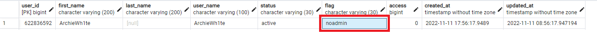
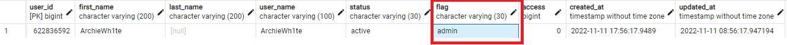

3. Что-бы дать права остальным сотрудникам нужно использовать команду `/флаг ID_пользователя`

**Запуск бота**

Все зависимости хранятся в файле `requirements.txt`

Для запуска бота используйте файл *```app.py```*

**Команды админа:**

```
/ответ id ТЕКСТ  - ответить пользователю от имени бота

/бан id причина  - забанить пользователя у бота

/разбан id  - снять бан пользователя

/нотис  - отправить уведомление всем сотрудникам ТП

/профиль ID-Пользователя  - Посмотреть профиль пользователя

/флаг ID-Администратора  - Дать права Администратора

/унфлаг ID-Администратора  - Снять права Администратора

/магазин ID-Пользователя НазваниеОрганизации  - Сменить организацию у пользователя

/удалить ID-Пользователя  - Удалить пользователя из БД

/фамилия ID-Пользователя Фамилия_Пользователя - Сменить Фамилию у пользователя

/имя ID-Пользователя Фамилия_Пользователя - Сменить Имя у пользователя

/номер ID-Пользователя Номер_Пользователя - Сменить номер у пользователя

/applist ID-Заявки - Узнать информацию по заявке

/paneladm - Панель Администратора
```
**Для работы вам потребуется:**
1) Создать виртуальное окружение ```python -m venv venv```
2) Активировать в **Windows**: ```venv\Scripts\activate``` или в **Linux**: ```source myenv/bin/activate``` 
3) Установить все зависимости ```pip install -r requirements.txt```.
4) Установить [PostgreSQL](https://www.postgresql.org/download/) и настроить его.
5) Отредактировать файл **.env** там указываете конфигурацию для подключения к **PostgreSQL**, токкен для бота, айди администраторов, айди разработчика.

```
# Здесь вы указываете токен своего бота полученного у @BotFather
BOT_TOKEN=123456789:ABCDEFGHJKHYPRPTPTP

# Айди админов кому будет приходить уведомление о запуске бота
ADMINS=12456789, 123456789, 123456789

# Данные для подключения к БД PostgreSQL
DATABASE_HOST=
DATABASE_USER=
DATABASE_PASSWORD=
DATABASE_NAME=
DATABASE_PORT=5432


# Айди разработчика
DEV_ID=123456789

# Айди группы куда будут отправляться заявки
TECH_CHAT_ID=-012345678910

# УРОВНИ ДОСТУПА
LEVEL_ACCESS_1=Тех.поддержка
LEVEL_ACCESS_2=Администратор
LEVEL_ACCESS_3=Руководитель
```

## Видео
**Регистрация пользователя**

[](https://youtu.be/YkVXT6cjICw)

**Подача заявки в группу ТП и ответ на неё**

[](https://youtu.be/3iXDVqx3fSg)


## Скриншоты

**Админский блок**

*Регистрация администратора*

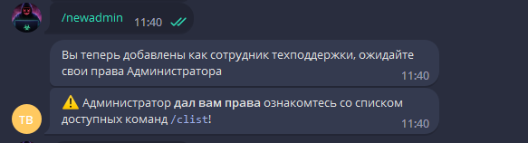

*После регистрации как администратор*

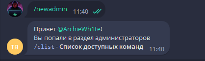

*Команды админа*

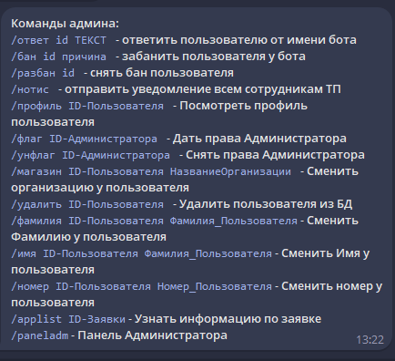

*Дать права администратора*

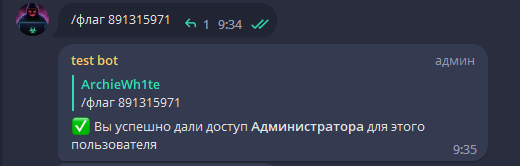

*Уведомление о запуске бота которое отправляется всем администраторам (сотрудникам ТП)*

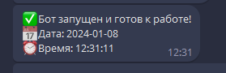

### Обзор админ панели

*Главное меню управления панели Администратора*

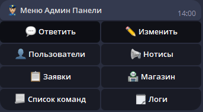

*Кнопка* 💬 **Ответить**

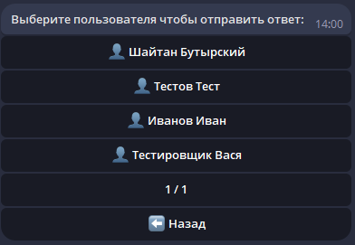

*Кнопка* 👤 **Пользователи**

Тут вы можете **забанить**, **разбанить**, **посмотреть профиль**, **удалить профиль**.

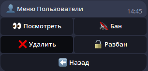

*Кнопка* 📋 **Заявки**

Тут вы можете просмотреть информацию о заявке.

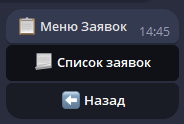

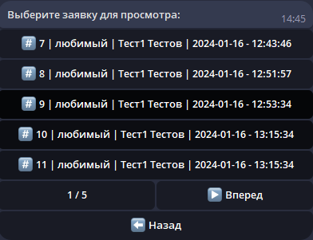

*Кнопка* 📃 **Список команд**

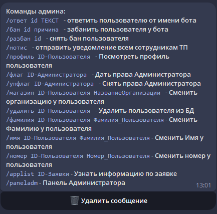

*Кнопка* ✏️ **Изменить**

Тут вы можете изменить данные пользователю: **Фамилию**, **Имя**, **Номер телефона**, **Магазин**.

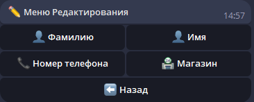

*Кнопка* 📢 **Нотисы**

Тут вы можете отправить нотис всем пользователям или сотрудником технической поддержки.

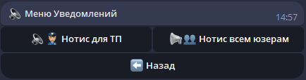

*Кнопка* 🏪 **Магазин**

Тут вы можете выполнять действия с магазинами: **разблокировать**, **заблокировать**, **добавить**, **удалить**, **редактировать** и посмотреть **список** магазинов.

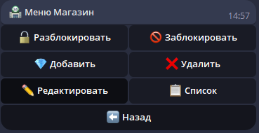

*Кнопка* 🗒 **Логи**

Тут вы можете скачать **логи чата** и **логи сервера**.

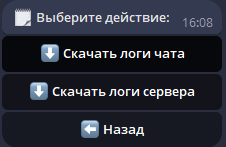

Логи сервера 

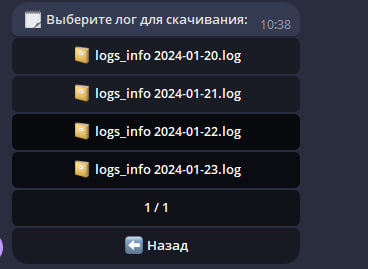

*Ответ через кнопку на заявку* **💬 Ответить**

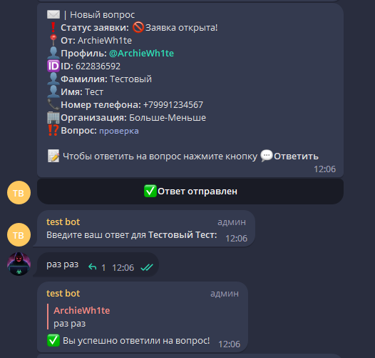

В этой обновленной версии теперь можно ещё ответить пользователю с картинкой.
Пример:

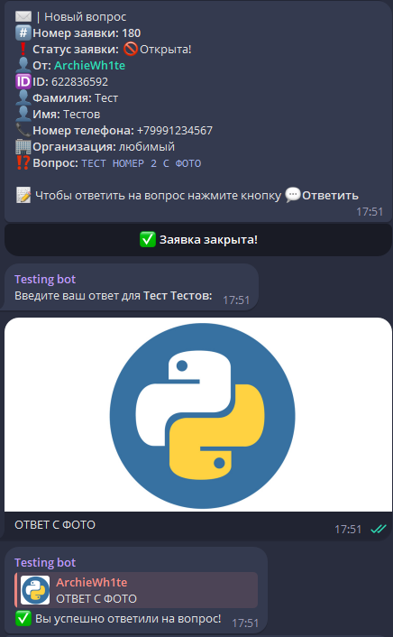

**Пользовательский блок**

*Команда /start*

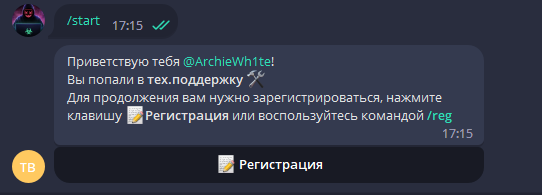

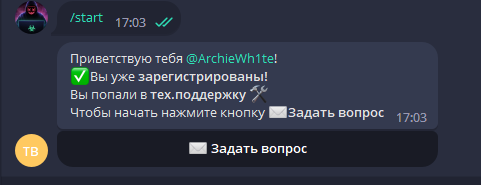

*Регистрация Фамилия:*

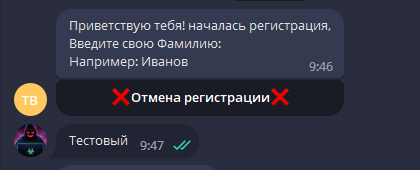

*Регистрация Имя:*

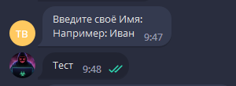

*Регистрация Номер:*

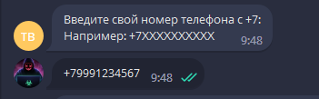

*Регистрация выбор Организации(Магазина):*

Магазин теперь добавляется в админ панели. 

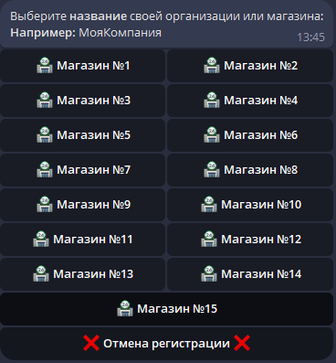

*Завершение регистрации*

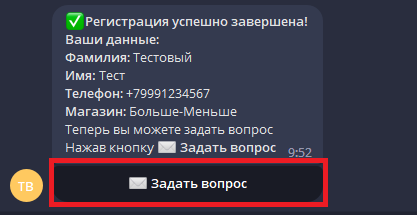

*Команда /start после регистрации*

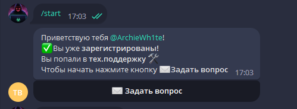

*Когда бот не видит команд*

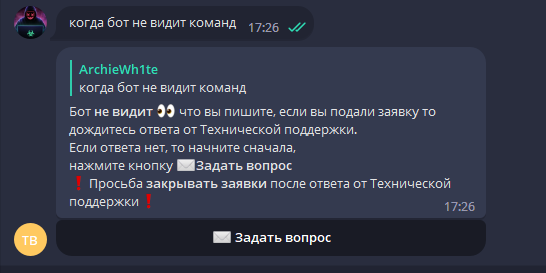

*После нажатия на кнопку Задать вопрос*

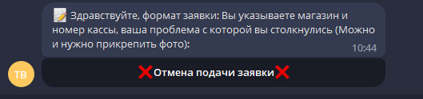

*Подача заявки*

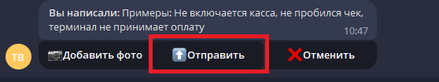


*Ответ от сотрудников ТП*

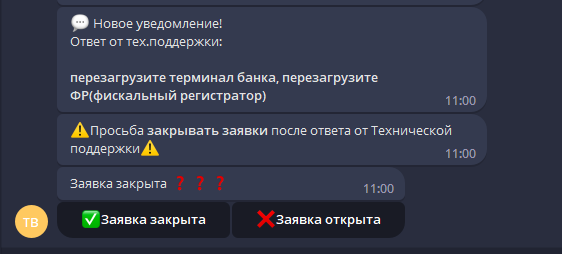

*После ответа от ТП Закрытие заявки*

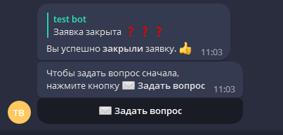

*Если заявку не закрыли то продолжаем диалог*

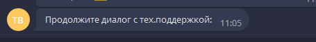